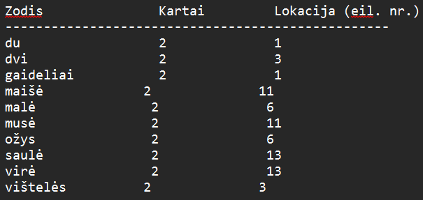
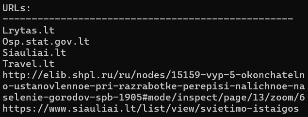

# EgzaminoUzduotis
## Programos aprašymas
Programa leidžia naudotojui sužinoti kiek pasirinktame tekstiniame faile yra du ir daugiau kartų pasikartojančių žodžių, jų kiekius bei sužinoti jų lokacijas (eilučių numerius). Programa taip pat turi funkciją rasti visas URL nuorodas minėtame tekstiniame faile. Rezultatai išvedami į `rezultatai.txt` failą, URL radimo atveju - naudotojui suteikiamas pasirinkimas (išvesti į failą/terminalą).
## Programos naudojimo instrukcija
1. Paleidžiame programą.
2. Naudotojas įveda norimo išanalizuoti ir `failai` aplankale išsaugoto `.txt` formato failo pavadinimą. 
### Meniu
* 1 - rasti pasikartojančius žodžius ir jų lokacijas; 
*Rezultatai išvedami į failą `rezultatai.txt`.*
* 2 - rasti tekste esančias URL nuorodas;
  * 2.1 - naudotojas pasirenka kur išvedami rezultatai:
      * 1 - rezultatai išvedami į failą `rezultatai.txt`; 
    *Rezultatai išvedami į failą `rezultatai.txt`.*
      * 2 - rezultatai išvedami į terminalą; 
    *Rezultatai išvedami į terminalą.*
* 3 - rasti tekste pasikartojančius žodžius ir jų lokacijas bei visame tekste esančias URL nuorodas; 
*Rezultatai išvedami į failą `rezultatai.txt`.*
3. Programa nustoja veikti, kai yra išvedami rezultatai terminale arba išvedama teksinė/informacinė eilutė, po vieno iš šių įvykių paspaudus, bet kurį klaviatūros klavišą programa užsidaro.
## Asociatyvūs konteineriai
Atliekant šią užduotį buvo naudoti asociatyvūs konteineriai `std::map` ir `std::set`. `std::map<> zodziai` konteineris buvo naudotas rinkti žodžius ir jų kiekius, esančius tekstiniame faile, o papildomas `std::map<> cross` konteineris buvo skirtas surinkti duomenis apie šių žodžių lokaciją. `std::set<> URLs` konteineris buvo naudojamas rinkti URL nuorodas esančias tekstiniame faile.
## Failai
### Programos failai:
* `EgzaminoUzduotis.cpp` - pagrindinis programos failas.
* `funkcijos.h` - programos funkcijų header'ių failas.
* `meniu.h` - meniu struktūros failas.
* `funkcijos.cpp` - programos funkcijų failas.
* `URLList_12.18` - URL domenų formatų sąrašas ištrauktas 12.18.
* `rezultatai.txt` - rezultatų failas.
### Programa testuoti failai:
* `Siauliai.txt` - ~2300ž.
* `Trakai.txt` - ~900ž.
* `testas.txt` - 39ž. (jokių URL nuorodų).
* `spidermenas.txt` - ~9400ž. (angl.k.).
## Rezultatai
 
*Pav.1* Pasikartojančių žodžių, kiekio ir jų lokacijos rezultatai.
  
 
*Pav.2* URL nuorodų tekstiniame faile rezultatai.
